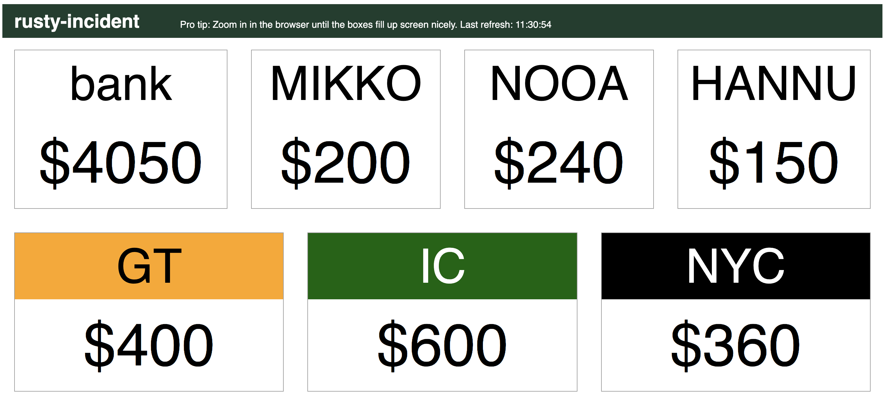

# 18SH Cash Display

[18SH](https://github.com/msaari/18sh) is great, except the cash information is unpleasantly hidden in the console. 18SH Cash Displays solves the problem by providing a separate display that will show player and company cash totals in larger, more easily visible format.

18SH Cash Display is a web server that receives updates from 18SH and has a simple web interface that shows the status. It is very low on features on purpose and for example has very thin security features. The purpose is to run it on a temporary server during the game and then run down the server, so security is not much of an issue.

## Installing

Clone the project and install the dependencies:

	git clone https://github.com/msaari/18sh-display.git
	cd 18sh-display
	npm install

Easiest solution to get a server live is to use a service like [Heroku](https://www.heroku.com/) – the free dynos Heroku provides are more than sufficient for this, and are completely free to use. Once you have Heroku installed and the CLI tools set up, getting a server running is as simple as

	heroku create
	git push heroku

This should get you a running server, with a name like `https://peaceful-sands-90210.herokuapp.com/`. To use this with 18SH, you need to set up an environmental variable that points to the running server. The exact method depends on your system ([see this helpful guide](https://www.schrodinger.com/kb/1842)). On my Mac running zsh, I do it like this:

	export DISPLAY18SH=https://peaceful-sands-90210.herokuapp.com/18sh/

In any case, the name of the environmental variable is `DISPLAY18SH` and you need to add `18sh/` to the end of the URL from Heroku (or wherever it is you host the server). This variable needs to be set on the system you use to run 18SH, not on the system that runs the Cash Display.

## Use during play

When you have the environmental variable set up and the server running, there's nothing else to do. 18SH will pick up the variable and will update the server with the new cash status after every move. All that remains is to point your browser to the server:

	https://peaceful-sands-90210.herokuapp.com/18sh/<gamename>

where `<gamename>` is the name of your game in 18SH. This should bring up the cash display. The display will refresh automatically every 5 seconds.

## Company colors

The display can show colors for companies. The colors are set from [a CSS file](/css/style.js) (it's a JavaScript module, but inside it's just CSS). Each name tag, company or player, will get a CSS class based on the name: it's the name with all non-alphanumeric characters replaced with underscores.

These classes can be used to set up colors for companies. The CSS file has some familiar companies already set up (18xx staples like PRR, B&O, C&O, NYC and Erie), and you can add more to suit your needs (if you do add more companies, please do a pull request so I can add them in).

## Example

## License

Copyright 2019 [Mikko Saari](https://github.com/msaari/) mikko@mikkosaari.fi

See [license information](LICENSE).